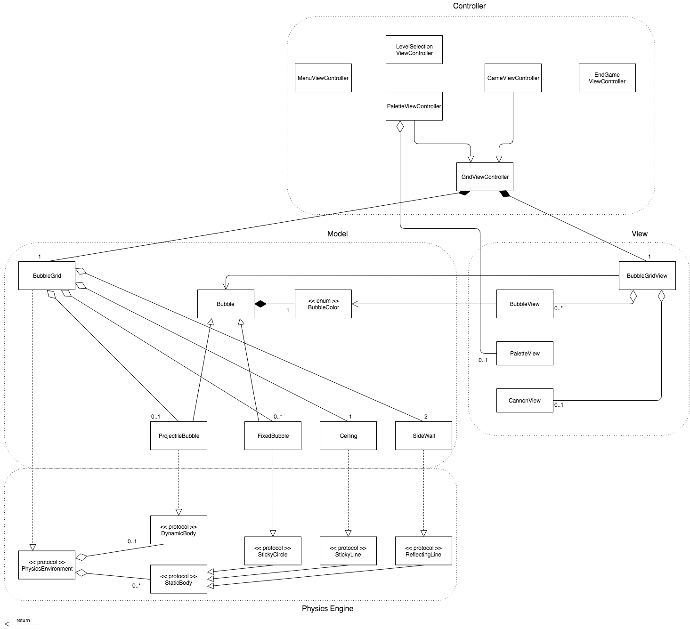

CS3217 Problem Set 4
==

**Name:** Thenaesh Elango

**Matric No:** A0124772E

**Tutor:** Li Kai

## Tips

1. CS3217's Gitbook is at https://www.gitbook.com/book/cs3217/problem-sets/details. Do visit the Gitbook often, as it contains all things relevant to CS3217. You can also ask questions related to CS3217 there.
2. Take a look at `.gitignore`. It contains rules that ignores the changes in certain files when committing an Xcode project to revision control. (This is taken from https://github.com/github/gitignore/blob/master/Swift.gitignore).
3. A SwiftLint configuration file is provided for you. It is recommended for you to use SwiftLint and follow this configuration. Keep in mind that, ultimately, this tool is only a guideline; some exceptions may be made as long as code quality is not compromised.
    - Unlike previous problem sets, you are creating the Xcode project this time, which means you will need to copy the config into the folder created by Xcode and [configure Xcode](https://github.com/realm/SwiftLint#xcode) yourself if you want to use SwiftLint. 
4. Do not burn out. Have fun!

## Problem 1: Design

## Problem 1.1

`ViewController` is where the display link is initialised and thus serves as the heartbeat for the entire system (i.e. calls methods in both the model and view).. Important gameplay elements, such as tracking the projectile state and deciding what to do when it is stopped by a collision with placed bubbles is also performed in methods defined here. This class, as the name implies, serves as the controller.

`BubbleGrid` is the main class for the model, storing the bubbles in the grid as well as the projectile as attributes. It provides useful methods to help the controller make decisions e.g. which grid point is nearest to the current coordinate point, which bubbles of the same colour are in the same connected component as some given bubble, etc. It contains a coordinate system (needed for physics calculations) that is different from the one in the view, and whose aspect ratio is defined directly by the number of rows vs the number of bubbles in each row. The view and model coordinate systems differ only by a scaling factor, so transformation is easy.

`BubbleGridView` is the main class for the view. It contains methods to render the bubble grid and the projectile (which in the view is simply a `BubbleView`), as well as to render with animation if needed. `BubbleGridView` also contains helper methods for translating to and from model and view coordinates. The animated rendering itself is done in the `BubbleView` class (which represents an individual bubble).

`PhysicsEnvironment`, `StaticBody` and `DynamicBody` are protocols which make up the physics engine. An instance of `PhysicsEnvironment` may contain any number of static bodies (which are stationary and are there to be collided with by the dynamic body) and at most one (for now) dynamic body (which can move). When its `simulate` method is called with a time delta from the display link, it can then simulate the motion of the dynamic body in the environment, including collisions with the static bodies. `DynamicBody` is implemented by `ProjectileBubble` in the model, which `StaticBody` is derived into a few specific protocols (`StickyCircle`, `StickyLine`, `ReflectingLine`) that are then implemented by the models representing collidable entities (`FixedBubble`, `Ceiling`, `SideWall`). `PhysicsEnvironment` itself is implemented by `BubbleGrid` as that is the class that contains all the physics objects in the model.

## Problem 1.2

Removing all bubbles of a given colour is a simple matter of adding a method into `BubbleGrid`, alongside the existing connected component tests. All that needs to be done is to iterate across the bubble grid and remove each bubble if the bubble is of the colour specified. This is easy to do because the grid is represented as a 2D array, and is efficient because there aren't many bubbles.

In general, adding more grid-related logic to be executed when the projectile lands on a bubble is done by adding methods to support that logic into `BubbleGrid` and modifying the method `handleProjectileLanding` (currently in the view controller) to use the additional functionality. If `BubbleGrid` starts getting too large, the methods relating to specific and complex game logic (as opposed to simple operations on the grid) can be refactored into a separate protocol that is then extended by `BubbleGrid`.

Adding additional physics logic will require additional protocols in the physics engine to represent the different types of bodies involved, and even possible modification of the `simulate` method in `PhysicsEnvironment`. We consider the case of adding a magnetic bubble object, which is possibly one of the more intrusive changes to the physics engine. The `StaticBody` protocol (which all objects the projectile can interact with derive from) has a `collide` method (usually changing the velocity of the projectile), which the `PhysicsEnvironment`'s `simulate` method calls only if the `DynamicBody` in the environment is colliding with it. For the case of a magnetic bubble, we can add a method `actAtDistance`, which the `simulate` method will always call whether or not the `DynamicBody` is colliding with it. We can supply a default implementation that does nothing. We can then create a `MagneticBody` protocol deriving from `StaticBody` that overrides `actAtDistance` to  affect the acceleration of the projectile in accordance with the inverse square law.

## Problem 2.1

The user inputs the angle for launching the bubble by swiping on the screen in the desired direction. This direction is determined by reading the `velocity` attribute of the corresponding `UIPanGestureRecognizer`, converting it to a vector in the model's coordinate space and normalising it.

## Problem 3: Testing

Your answer here
